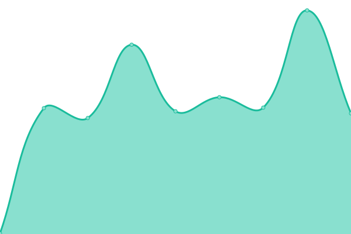

# [📈 Live Status](https://Dicloxacillin.github.io/ucportals): <!--live status--> **🟧 Partial outage**

This repository contains the open-source uptime monitor and status page for [Dicloxacillin](https://Dicloxacillin.github.io/ucportals), powered by [Upptime](https://github.com/upptime/upptime).

With [Upptime](https://upptime.js.org), you can get your own unlimited and free uptime monitor and status page, powered entirely by a GitHub repository. We use [Issues](https://github.com/Dicloxacillin/ucportals/issues) as incident reports, [Actions](https://github.com/Dicloxacillin/ucportals/actions) as uptime monitors, and [Pages](https://Dicloxacillin.github.io/ucportals) for the status page.

<!--start: status pages-->
<!-- This summary is generated by Upptime (https://github.com/upptime/upptime) -->
<!-- Do not edit this manually, your changes will be overwritten -->
<!-- prettier-ignore -->
| URL | Status | History | Response Time | Uptime |
| --- | ------ | ------- | ------------- | ------ |
|  [Skingenes](http://www.skingenes.net) | 🟥 Down | [skingenes.yml](https://github.com/Dicloxacillin/ucportals/commits/HEAD/history/skingenes.yml) | 

 454ms
     
 | 

<a href="https://Dicloxacillin.github.io/ucportals/history/skingenes">99.99%</a>
    

|  [U54 Data Portal](https://ucightf1.biochem.uci.edu) | 🟥 Down | [u54-data-portal.yml](https://github.com/Dicloxacillin/ucportals/commits/HEAD/history/u54-data-portal.yml) | 

 0ms
     
 | 

<a href="https://Dicloxacillin.github.io/ucportals/history/u54-data-portal">0.00%</a>
    

|  [Google](https://www.google.com) | 🟩 Up | [google.yml](https://github.com/Dicloxacillin/ucportals/commits/HEAD/history/google.yml) | 

 91ms
     
 | 

<a href="https://Dicloxacillin.github.io/ucportals/history/google">100.00%</a>
    

|  [Test Broken Site](https://thissitedoesnotexist.koj.co) | 🟥 Down | [test-broken-site.yml](https://github.com/Dicloxacillin/ucportals/commits/HEAD/history/test-broken-site.yml) | 

 0ms
     
 | 

<a href="https://Dicloxacillin.github.io/ucportals/history/test-broken-site">100.00%</a>
    

<!--end: status pages-->

[**Visit our status website →**](https://Dicloxacillin.github.io/ucportals)

## 📄 License

- Powered by: [Upptime](https://github.com/upptime/upptime)
- Code: [MIT](./LICENSE) © [Dicloxacillin](https://Dicloxacillin.github.io/ucportals)
- Data in the `./history` directory: [Open Database License](https://opendatacommons.org/licenses/odbl/1-0/)
